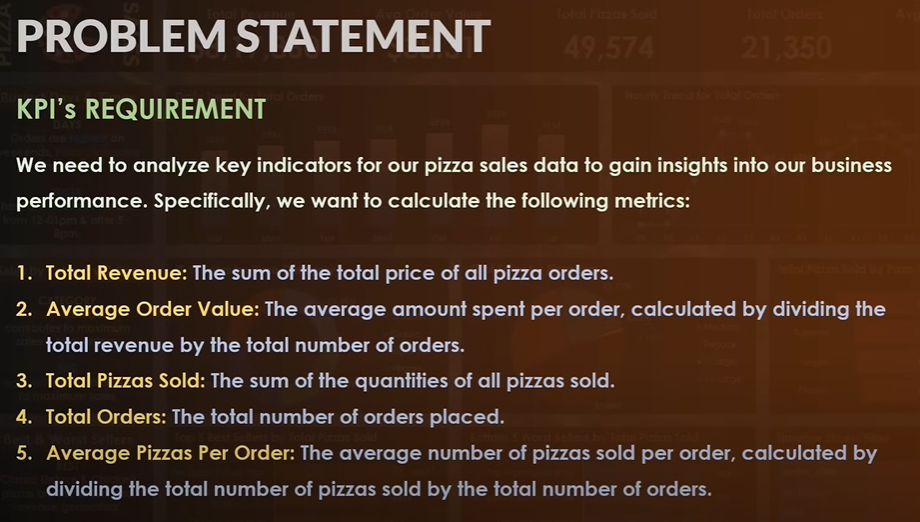
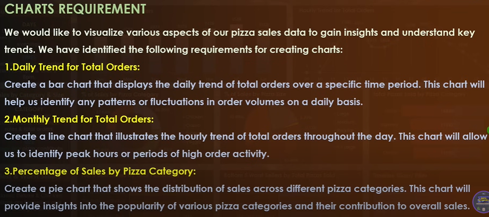
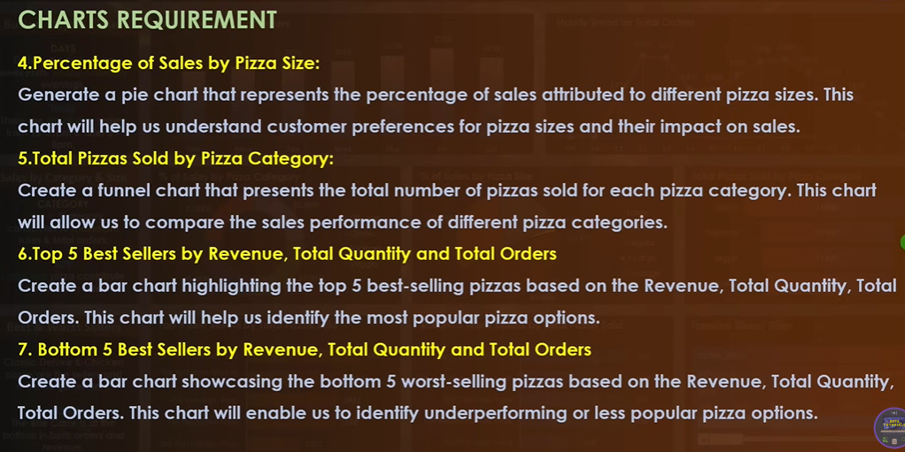
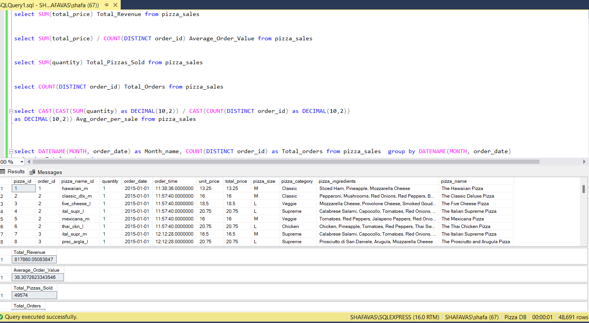
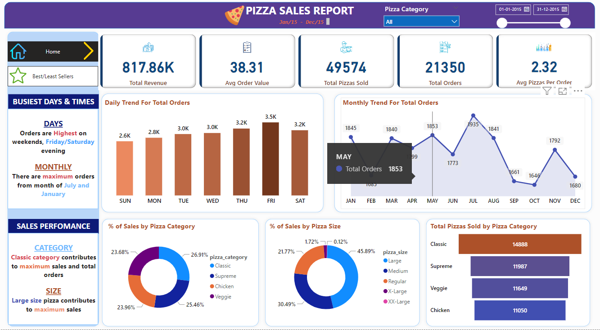
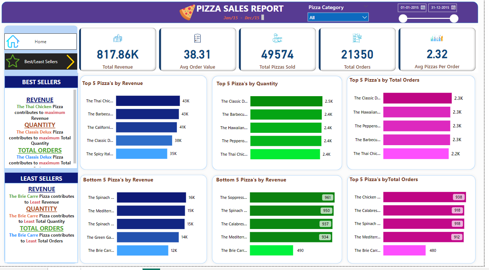

# DOCUMENTATION 

## PORTFOLIO ANALYSIS ON PIZZA SALES OF A RESTAURANT

The portfolio is based on different categories of Pizza of a restaurant and its sales throughout a year.
This is not an actual data but a fully random data of an imaginery Pizza restaurant that have taken from google.
The main objective of the portfolio analysis is to get more familiar with the concept of SQL and dive deeper into Power Bi.

## Below are its Problem statement.

Executed these problem statement in SQL server management studio

Created Dashboards with these results in Power Bi

